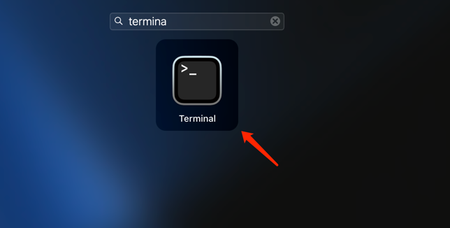
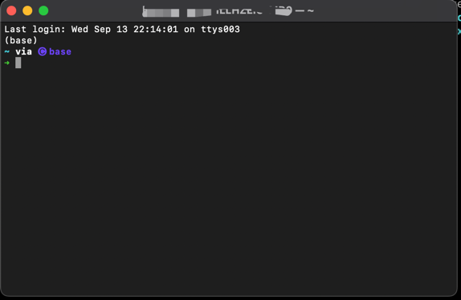

Setup
-----

## Find your terminal
A place to interact with your computer





- 它能干啥：你可以在这里指挥你的电脑做各种各样的事情，远远比你单纯使用各种带图形化的软件可以做的事情多得多

## Use iTerm2(Optional)
The macOS Terminal Replacement

> 如果想安的话，点这里吧：https://iterm2.com/

- 为啥有了terminal还来个这：对官方自带的terminal不满意呗

## Install homebrew
Package manager for macOS
> you may also want to access https://brew.sh/
```bash
# Install by entering the following command into your terminal
/bin/bash -c "$(curl -fsSL https://raw.githubusercontent.com/Homebrew/install/HEAD/install.sh)"
```

- 为啥要安装homebrew：这是macOS下的包管理工具，我们可以用homebrew来安装各种东东

## Install the zsh(Recommend)
```bash
# Install zsh via homebrew
brew install zsh

# 安装完成后输入以下命令，如果成功输出版本号，就代表你安装成功了
zsh --version
```

- What is `zsh`：A shell with a lot of features that makes you HIGHLY PRODUCTIVE 

## Install Python3
```bash
# install python3 via homebrew 
brew install python3
```

- 这时候就可以通过homebrew轻松的安装好python了